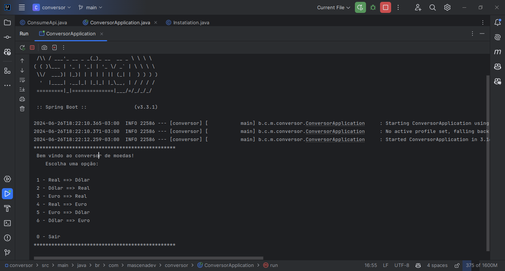

[](https://github.com/Gilberto-Mascena/conversor-de-moedas-java)
[](https://github.com/Gilberto-Mascena/conversor-de-moedas-java/blob/main/LICENSE.md)
[](https://github.com/Gilberto-Mascena/conversor-de-moedas-java/stargazers)
[](https://github.com/Gilberto-Mascena/conversor-de-moedas-java/issues)


[English](https://github.com/Gilberto-Mascena/conversor-de-moedas-java/blob/main/README-en.md) |
[Português Brasileiro](https://github.com/Gilberto-Mascena/conversor-de-moedas-java/blob/main/README.md)

# *Challenger ONE Java back-end training*

## *🚀 About the project*

### Challenge proposed by ONE Java back-end developer training.

Create a currency converter that converts from one currency to another, using the
[ExchangeRate-API](https://www.exchangerate-api.com/) API
Project developed in Java, using the Spring Boot framework, on the command line

#### At least 6 options are required for currency conversion

*In this project, 6 currency conversion options were implemented, namely*:

* _*BRL(Real) => USD(Dollar)*_
* _*USD(Dollar) => BRL(Real)*_
* _*EUR(Euro) => BRL(Real)*_
* _*BRL(Real) => EUR(Euro)*_
* _*EUR(Euro) => USD(Dollar)*_
* _*USD(Dollar) => EUR(Euro)*_

## *Technologies used*
- [Java 21](https://www.oracle.com/br/java/technologies/downloads/)
- [Spring Boot](https://spring.io/projects/spring-boot)
- [Maven](https://maven.apache.org/)
- [Git](https://git-scm.com/)

## Requirements

- [Java 21 or higher](https://www.oracle.com/br/java/technologies/downloads/)
- [Maven](https://maven.apache.org/)
- [Git](https://git-scm.com/)
- Account on the API [ExchangeRate-API](https://www.exchangerate-api.com/), and generate a key to consume the API

## How to run the project:

- Clone the project:
- *Logged into github*

```
git clone git@github.com:Gilberto-Mascena/conversor-de-moedas-java.git
```
- *Without being logged into github*.
```
git clone https://github.com/Gilberto-Mascena/conversor-de-moedas-java.git
```

- Open the project in an IDE of your choice.
- In the root of the project, create a file called .env and add: API_KEY_EXCHANGE_RATE_API="_*your API key here*_", save the file!.
- Open a terminal or prompt in the project folder and run the command:
```
mvn spring-boot:run
```

## *Image of the running project*



## *Project badge*


## *License*

*The* [*License MIT*](LICENSE.md) (*MIT*)

### Gilberto | Dev _2024_