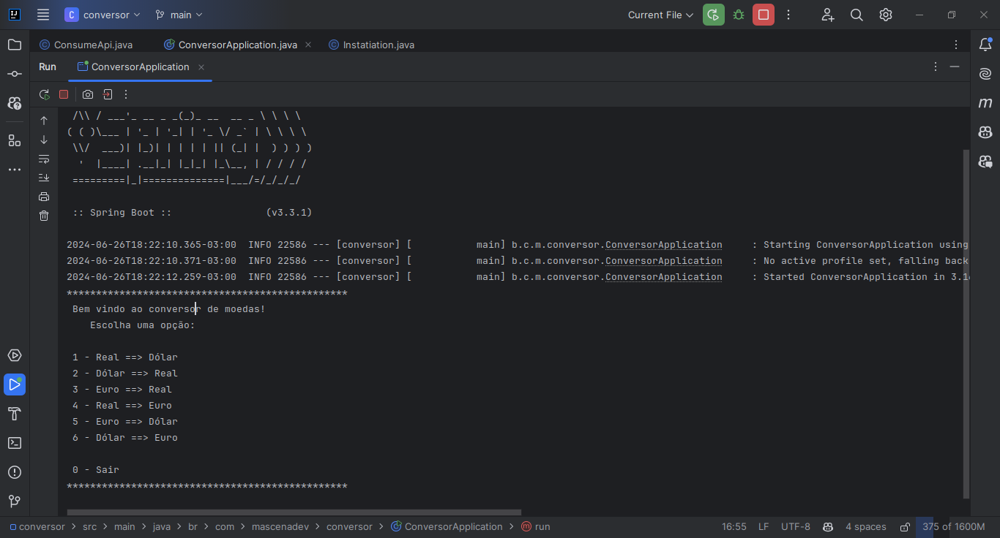

## *Challenger ONE Formação back-end java*

### *🚀 Sobre o projeto*

- ##### Desafio proposto pela ONE Formação de desenvolvedor back-end java.
Criar um conversor de moedas, que converta de uma moeda para outra, utilizando a API [ExchangeRate-API](https://www.exchangerate-api.com/).
Projeto desenvolvido em Java, utilizando o framework Spring Boot, na linha de comando.

- ##### Necessário pelo menos 6 opções para conversão de moedas.
Neste projeto foram implementadas 6 opções de conversão de moedas, sendo elas: _**BRL(Real) => USD(Dóllar), USD(Dóllar) => BRL(Real), EUR(Euro) => BRL(Real), BRL(Real) => EUR(Euro), EUR(Euro) => USD(Dóllar) e USD(Dóllar) => EUR(Euro).**_ 

##

### *Imagem do projeto em execução*

##

### *Tecnologias usadas*

##    

##

### *Licença*

*The* [*MIT License*](LICENSE.md) (*MIT*)
